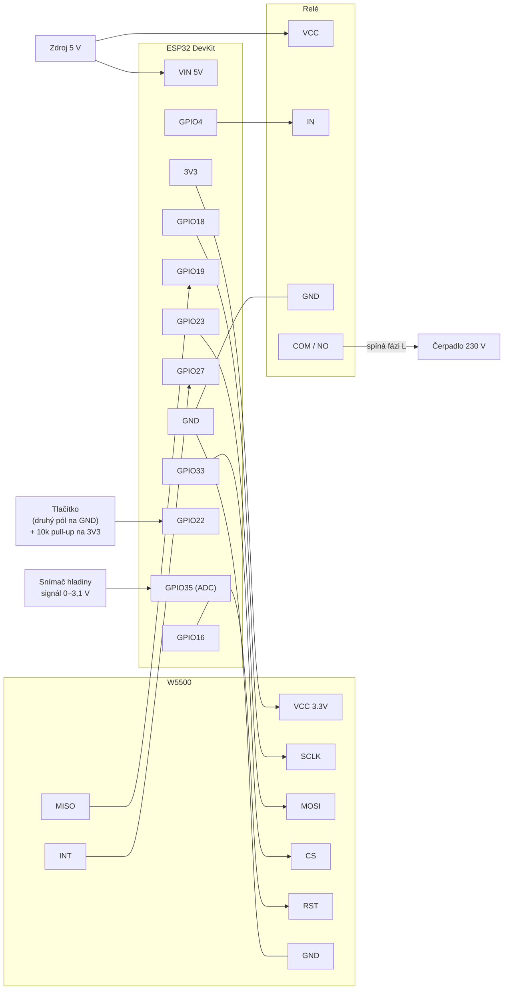

# Snímač hladiny vody s ovládáním čerpadla pro automatickou závlahu

Projekt je postavený na ESP32 s ethernetovým modulem W5500 Lite a diferenciálním snímačem tlaku, který měří výšku vodního sloupce. Otestováno s komponentami uvedenými v sekci **Hardware**.

Konfigurační YAML soubor najdete ve složce `sw`, fotografie hotového prototypu ve složce `foto`.

## Historie verzí

Zde popsané zapojení je už třetí iterací:

1. **Bateriová verze** – ESP32 byl většinu času uspaný a jednou za 30 minut odeslal data přes WiFi. Napájel ho jeden článek s kapacitou 4 Ah, který na jedno nabití vydržel přibližně rok. Kvůli plánovanému rozšíření o automatickou závlahu trávníku bylo potřeba přejít na novou verzi.
2. **Verze s trvalým napájením** – zařízení je napájené trvale z 24 V a umí spínat 230V čerpadlo, včetně jeho ochrany při poklesu hladiny pod nastavenou mez. Data se stále odesílala přes WiFi, což kvůli slabému signálu občas způsobovalo výpadky (anténa je v šachtě pod poklopem).
3. **Verze s ethernetem** – přibyl ethernetový modul W5500, takže data jdou po kabelu a výpadky WiFi už nehrozí.

## Hardware

### Přehled pinů

| GPIO ESP32 | Připojeno k | Směr | Poznámka |
|-----------:|-------------|------|----------|
| **GPIO18** | W5500 **SCLK** | výstup | SPI hodiny (8 MHz) |
| **GPIO23** | W5500 **MOSI** | výstup | SPI data ESP → W5500 |
| **GPIO19** | W5500 **MISO** | vstup | SPI data W5500 → ESP |
| **GPIO33** | W5500 **CS / SCS** | výstup | chip select |
| **GPIO27** | W5500 **INT** | vstup | přerušení |
| **GPIO16** | W5500 **RST** | výstup | reset modulu |
| **GPIO4**  | Relé **IN** | výstup | **HIGH = čerpadlo běží** |
| **GPIO22** | Tlačítko | vstup | aktivní v **LOW** (tlačítko proti GND), nutný externí pull-up 10 kΩ |
| **GPIO35** | Snímač hladiny – signál | analog. vstup | ADC1, útlum 12 dB → rozsah cca 0–3,1 V |

### Schéma zapojení


#### Tlačítko (GPIO22)

```
3V3 ──[ 2.2 kΩ ]──┬────────── GPIO22
                  │
                [ TL ] (spínací tlačítko)
                  │
GND ──────────────┘
```

#### Snímač hladiny (GPIO35)

```
Snímaš OUT ──[ R1 ]──┬───────┬────────── GPIO35
                     │       │
                   [ R2 ]   === 100 nF
                     │       │
GND ─────────────────┴───────┴────────── GND sondy
```

#### Spínání relé (GPIO4)

```
GPIO4 ──[ 2.2 kΩ ]──┬──────────────── báze tranzistoru BC337
                    │      
                [ 2.2 kΩ ]   
                    │      
GND ────────────────┴──────────────── emitor tranzistoru BC337
```

### BOM

- [ESP32](https://www.laskakit.cz/laskakit-esp32-devkit/?variantId=11481)
- [Ethernetový modul W5500](https://www.laskakit.cz/mikro-ethernet-modul-w5500/)
- [DC/DC měnič s LM2596](https://www.laskakit.cz/step-down-menic-s-lm2596/)
- 2× [dioda 1N4148](https://www.gme.cz/v/1487018/semtech-1n4148-dioda)
- 1x [dioda 1N4007](https://www.gme.cz/v/1493670/1n4007-dioda)
- 2× [tranzistor BC337](https://www.gme.cz/v/1485969/semtech-bc337-25-bipolarni-tranzistor)
- 1× [kondenzátor 100 nF](https://www.gme.cz/v/1489676/hitano-ck-100n-50v-x7r-rm508-10-keramicky-kondenzator)
- 1× [kondenzátor 470 µF / 35 V](https://www.gme.cz/v/1489656/hitano-ce-470u-35vit-hit-esx-10x20-rm5-bulk-elektrolyticky-kondenzator)
- Rezistory **(TBD hodnoty)**
- Svorky WAGO
  - 3× [oranžová](https://www.gme.cz/v/1499108/wago-256-746-svorkovnice-1pol-roztec-508mm-24a-320v-vstup-45-pruzina)
  - 3× [světle šedá](https://www.gme.cz/v/1499111/wago-256-401-svorkovnice-1pol-roztec-508mm-24a-320v-vstup-45-pruzina)
  - 1× [modrá](https://www.gme.cz/v/1499107/wago-256-744-svorkovnice-1pol-roztec-508mm-24a-320v-vstup-45-pruzina)
  - 1× [zelená](https://www.gme.cz/v/1499109/wago-256-747-svorkovnice-1pol-roztec-508mm-24a-320v-vstup-45-pruzina)
  - 1× [tmavě šedá](https://www.gme.cz/v/1499047/wago-256-742-svorkovnice-1pol-roztec-508mm-24a-320v-vstup-45-pruzina)
  - 1× [bočnice oranžová](https://www.gme.cz/v/1501453/wago-256-600-bocnice-pro-256-oranzova)
  - 1× [bočnice modrá](https://www.gme.cz/v/1501452/wago-256-400-bocnice-pro-256-modra)
  - 1× [bočnice tmavě šedá](https://www.gme.cz/v/1501440/wago-236-200-bocnice-pro-236-tmave-seda)
- Voděodolná zásuvka – [KV Elektro](https://www.kvelektro.cz/zasuvka-scame-protecta-ip66-137-4411-do-sestav-bez-krabice-p1236195) nebo [Alza](https://www.alza.cz/hobby/solight-zasuvka-ip66-vodotesna-a-prachotesna-d12895804.htm)
- [Relé](https://www.gme.cz/v/1515853/finder-406190054000-rele-civka-5vdc-kontakt-250vac-16a-1x-prepinaci) s [paticí](https://www.gme.cz/v/1498684/finder-9505-patice-pro-rele-4051-52-61-na-din-listu) na DIN lištu
- [Snímač hladiny vody](https://allegro.cz/produkt/fotoelektricky-snimac-hladiny-kapaliny-4-20ma-ip68-ponorny-5d731506-9f41-4c8e-a7c2-fc99b2056e58?offerId=18372650584) – snímačů existuje celá řada, na AliExpressu je najdete pod heslem **Liquid Level Transmitter**. Já používám verzi s napájením 5 V a napěťovým výstupem (0–3.3) V, který odpovídá výšce hladiny (0–3) m. Napájecí napětí snímače 5 V jsem historicky zvolil kvůli napájení z baterie. S vyšším napájecím napětí (24 V) rapidně roste množství snímáčů ze kterých lze vybírat.
- [Univerzální DPS 160 × 100 mm](https://www.gme.cz/v/1508180/rademacher-up830ep-univerzalni-spoj-160x100mm)
- Voděodolná krabička
  
## MQTT
| Topic | Směr | Payload | Význam |
|-------|------|---------|--------|
| `zavlaha/cerpadlo/set` | → ESP | `ON` / `OFF` | zapnutí / vypnutí čerpadla |
| `zavlaha/cerpadlo/state` | ESP → | `ON` / `OFF` | aktuální stav (posílá se i po restartu) |
| `zavlaha/log` | ESP → | text | log zařízení |
| `zavlaha/sensor/...` | ESP → | číslo | hodnoty senzorů (hladina, objem, napětí) |

## Nahrání firmwaru
Obecný popis [zde](https://esphome.io/guides/getting_started_command_line.html).

1. Vytvořte `secrets.yaml` vedle `zavlaha.yaml`:

   ```yaml
   api_key: "BASE64_KLIC_32_BAJTU"
   ota_password: "heslo_ota"
   mqtt_user: "uzivatel"
   mqtt_password: "heslo"
   ```
2. Změňte IP adresu MQTT brokeru na svoji.

   ```yaml
   broker: <Vaše IP MQTT brokeru>
   ```
4. Modifikujte přepočet výšky hladiny na objem podle typu nádrže.  
   V mém konkrétním případě je počítáno s válcovou nádrží naležato o objemu 5000 litrů, průměrem 1.8 metru a délkou 2.2 metru.
   
      ```yaml
      lambda: |-
      // Read water level from a separate sensor (in cm), convert to meters
      float h_cm = id(hladina_vody).state;
      float h = h_cm / 100.0;
    
      // Tank geometry
      const float r = 0.85; // radius in meters
      const float L = 2.2;  // length in meters
    
      // Basic validation
      if (h > 0.0 && h < 2*r) {
        float theta = acos((r - h) / r);
        float segment_area = (r * r * theta) - ((r - h) * sqrt(2 * r * h - h * h));
        float volume_liters = segment_area * L * 1000.0;
        return roundf(volume_liters);
      } else if (h >= 2 * r) {
        // Full tank
        float volume_liters = M_PI * r * r * L * 1000.0;
        return roundf(volume_liters);
      } else {
        return 0;
      }
      ```
6. První nahrání přes USB:

   ```bash
   esphome run zavlaha.yaml
   ```

7. Další aktualizace už přes síť (OTA).
